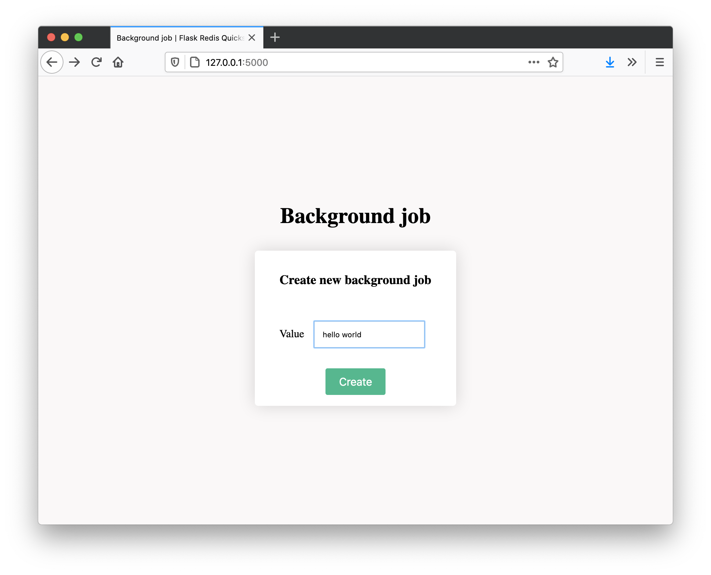

# Background job



This quickstart template allows you to initiate a background job that will be run asyncronously. You can click on a button from a frontend, and run a process in the background for example.

## Running
You should already have python3 running with redis, as set up in the root of the project. To run this example, you will need to run the following:
```
# Start the server
python app.py

# In another window, start the worker
python worker.py
```

You will now be able ot access the front end via [localhost:5000](http://localhpst:5000). Whenever you submit a new job, it will start being processed by the worker. For demo purposes, all this will do is to print a message after the code has run for 10s.