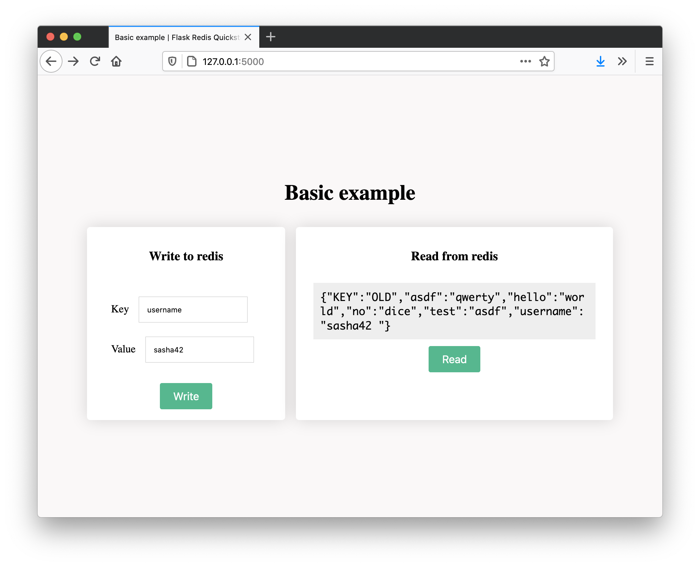

# Basic example



This quickstart template allows you to read and write from redis. There is nothing async, and no background processes - it only shows the basic interaction.

## Running
You should already have python3 running with redis, as set up in the root of the project. To run this example, you will need to run the following:
```
python app.py
```

You will now be able ot access the front end via [localhost:5000](http://localhpst:5000). Whenever you submit a key and value, it will be saved to redis. This is really useful if you're interfacing with other apps for example.